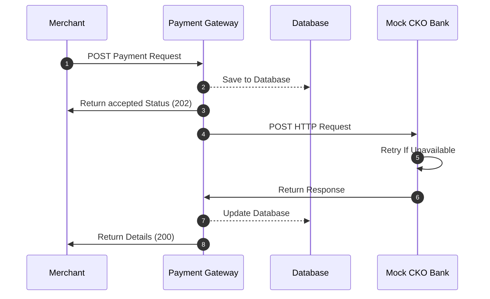
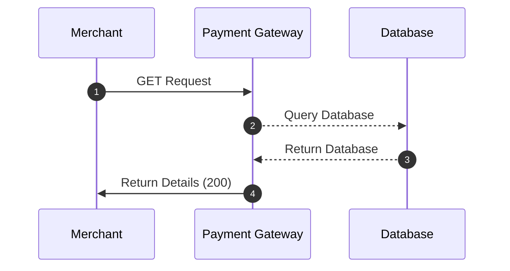
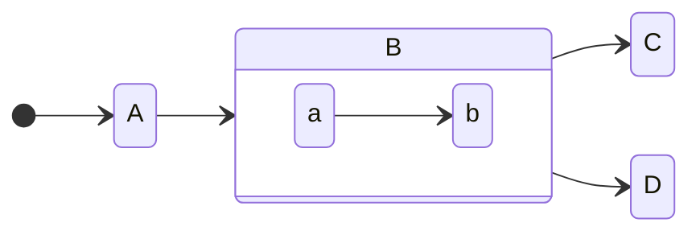

## Payment Journey 

```mermaid
sequenceDiagram
    autonumber
    participant Merchant
    participant PG as Payment Gateway 
    participant DB as Database
    participant Bank as Mock CKO Bank
    Merchant->>PG: POST Payment Request
    PG-->>DB: Save to Database
    PG->>Merchant: Return accepted  Status (202)

    PG->>Bank: POST HTTP Request 
    Bank->>Bank: Retry If Unavailable     
    Bank->>PG: Return Response
    PG-->>DB: Update Database    
    PG->>Merchant: Return Details (200)
```

## Details Lookup

```mermaid
sequenceDiagram
    autonumber
    participant Merchant
    participant PG as Payment Gateway 
    participant DB as Database
    Merchant->>PG: GET Request
    PG-->>DB:Query Database
    DB-->>PG:Return Database
    PG->>Merchant: Return Details (200)
```

```mermaid
stateDiagram
    direction LR
    [*] --> A
    A --> B
    B --> C
    state B {
      direction LR
      a --> b
    }
    B --> D
```