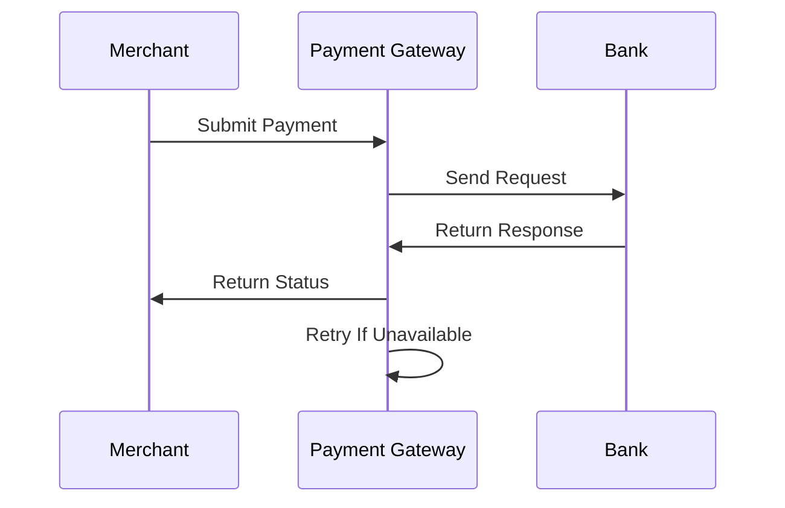
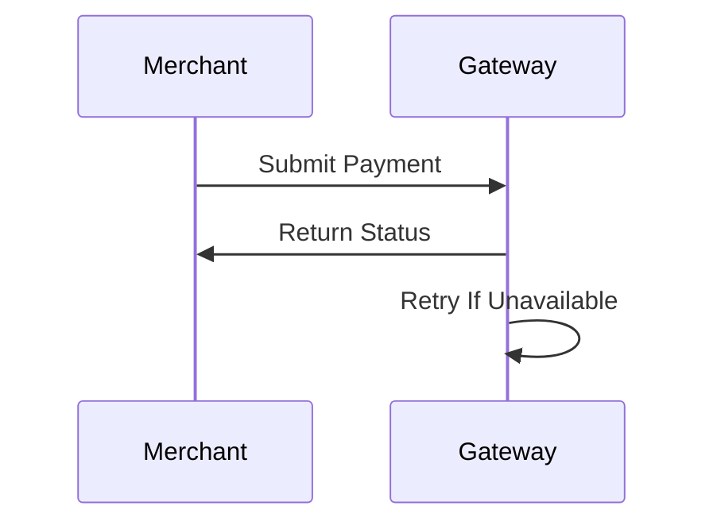

# payment-gateway

## Payment Journey 

```mermaid
sequenceDiagram
    participant Merchant
    participant Payment Gateway
    participant Bank
    Merchant->>Payment Gateway: Submit Payment
    Payment Gateway->>Bank: Send Request 
    Bank->>Payment Gateway: Return Response 
    Payment Gateway->>Merchant: Return Status
    Payment Gateway->>Payment Gateway: Retry If Unavailable 
```

## Details Lookup

```mermaid
sequenceDiagram
    participant Merchant
    participant Gateway
    Merchant->>Gateway: Submit Payment
    Gateway->>Merchant: Return Status
    Gateway->>Gateway: Retry If Unavailable 
```